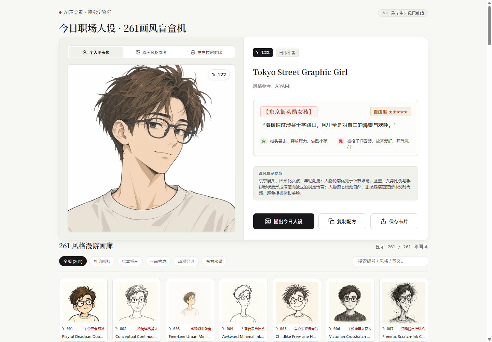
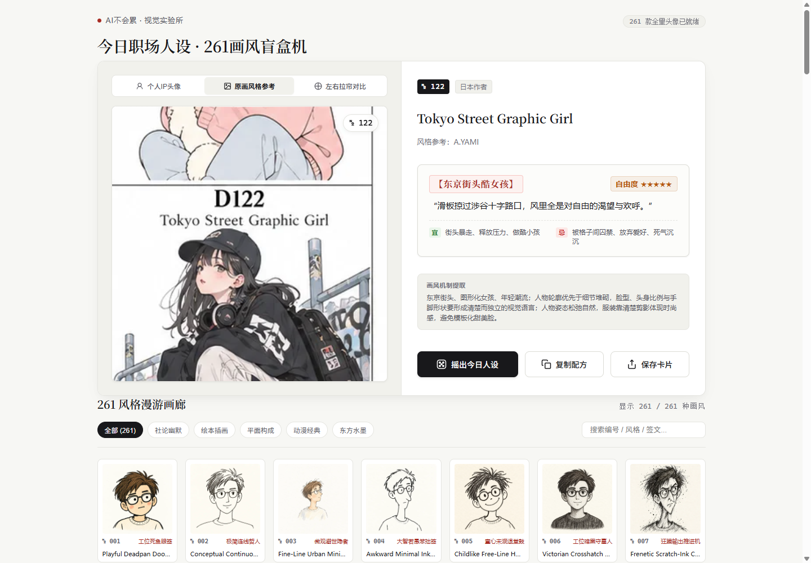
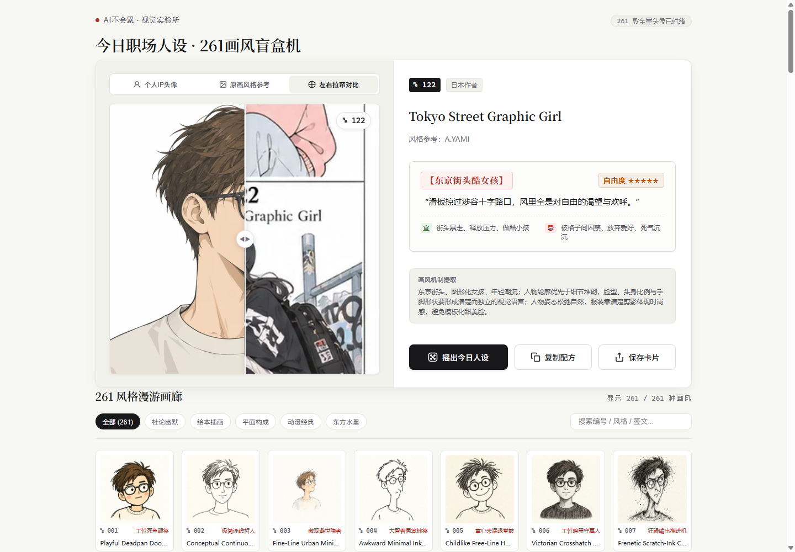
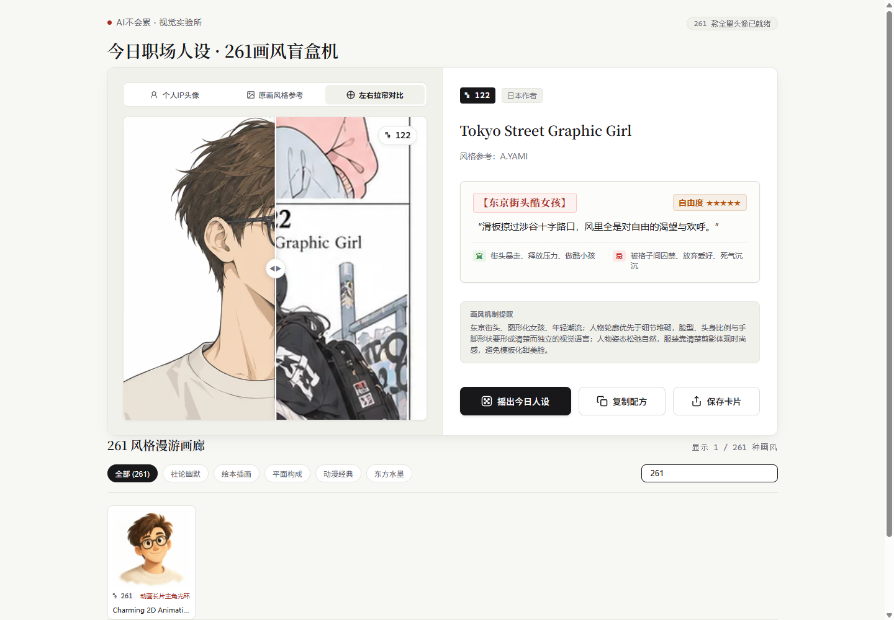
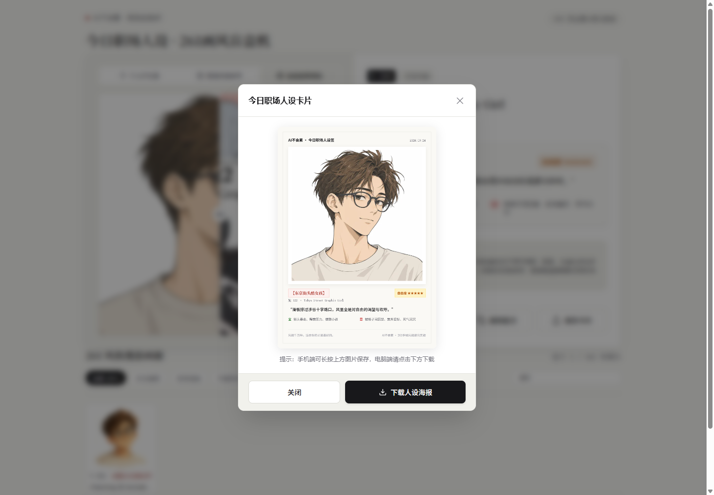

# 260+多样手绘画风头像盲盒机

一个可在浏览器本地运行的静态页面，用随机抽取、检索和对比的方式浏览 260+种手绘风格头像。

## 功能

- 随机抽取风格，并查看对应头像、风格信息和人设签

- 浏览、搜索 260+种风格

- 对比头像与风格参考图，支持拖动分割线

- 复制当前风格的生图提示词

- 在浏览器中生成并下载分享卡片

## 界面示例

以下截图来自本地运行页面，依次展示头像与人设签、上游原画风格参考、左右拉帘对比、风格检索和分享卡片预览。

<table>
  <tr>
    <td align="center"><strong>头像盲盒主页</strong><br></td>
    <td align="center"><strong>原画风格参考</strong><br></td>
  </tr>
  <tr>
    <td align="center"><strong>左右拉帘对比</strong><br></td>
    <td align="center"><strong>风格检索</strong><br></td>
  </tr>
  <tr>
    <td align="center"><strong>分享卡片预览</strong><br></td>
    <td></td>
  </tr>
</table>

## 本地运行

在仓库根目录启动静态服务器：

```bash
python -m http.server 8000
```

打开 <http://localhost:8000>。页面通过 HTTP 读取 `data/styles.json`，不能直接双击 `index.html` 使用。

项目使用原生 HTML、CSS 和 JavaScript，无构建步骤、后端服务或运行时依赖。提示词复制和卡片导出都在用户主动点击后由浏览器完成。

## 文件结构

```text
.
├── index.html
├── app.js
├── style.css
├── data/
│   └── styles.json
├── assets/
│   ├── avatars/     # 260+ 张头像图
│   └── previews/    # 260+ 张风格参考图
├── output/
│   └── playwright/  # README 界面示例截图
├── .gitignore
├── LICENSE
├── THIRD_PARTY_NOTICES.md
└── README.md
```

## 隐私与网络

页面不需要账号、API Key 或后端。运行时代码只读取仓库内的 JSON 和图片文件，没有配置第三方分析、远程字体或外部 API。提示词复制会调用浏览器剪贴板，卡片图片在浏览器中生成并由用户下载。

## 数据、图片与许可证

代码许可和图片素材说明分开管理，详见 [LICENSE](LICENSE) 与 [THIRD\_PARTY\_NOTICES.md](THIRD_PARTY_NOTICES.md)。风格参考图来自上游手绘风格 SKILL；个人头像图是风格迁移尝试，仅作示例和参考，允许下载试用。两类图片均不适用本仓库自有代码的 MIT 许可。
